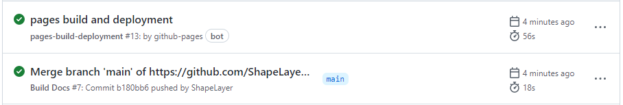

This repository is no longer maintained.  
Current version of s.ho9.me is [here](https://github.com/ShapeLayer/s.ho9.me).  

---
# s.ho9.me
Short link generator for `ho9.me` domain using Github Actions.

  

When pushing a new commit that changes [`links.json`](./links.json), [Python script (`app.py`)](./app.py) will generate a new Jekyll post redirecting the target link.  

## Getting Started
Clone this repository and modify `links.json`. Then turn on Github Pages.

```json
[
  {
    "filename": "filename to be set in the build result",
    "title": "title",
    "date": "`YYYY-MM-DD hh:mm:ss +timezone` or `default`. `default` will be changed to 0000-00-00",
    "template": "template .md file name that in the templates folder (default)",
    "target": "link to redirect",
    "permalink": "link to serve",
    "description": "description meta tag content"
  },
  ...
]
```

If above task is done, ghpages will serve `(domain)/(permalink)`. (ex. https://s.ho9.me/jnu)
